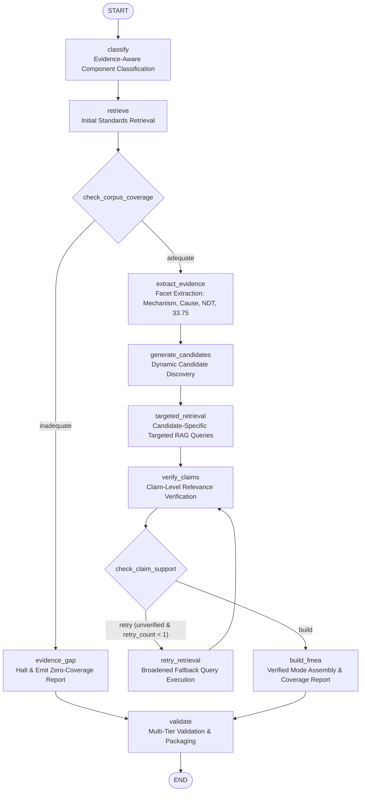

# Phase 5B — Evidence-Grounded Reasoning Architecture

## 1. Executive Summary

Phase 5B transitions FMEA-GPT from a static template-generation model into an **evidence-grounded engineering reasoning engine**. 

Prior to Phase 5B, the system operated linearly: it selected fixed CFM56 turbine failure-mode templates from internal Python dicts and attached broad semantic search chunks uniformly across all entries. 

The core epistemological principle introduced in Phase 5B is:
$$\text{"The model knows this failure mode"} \neq \text{"The available evidence supports this failure mode"}$$

When engineering evidence is absent or mismatched, the reasoning pipeline explicitly rejects or flags claims, and halts or branches into an **evidence gap report** rather than manufacturing technical analyses.

---

## 2. LangGraph Architecture & Workflow

The reasoning pipeline is orchestrated via a state graph compiled with `langgraph`.



---

## 3. Node Inventory & Responsibilities

| Node Name | Module Path | Purpose & Epistemological Role |
| :--- | :--- | :--- |
| `classify` | [classifier.py](file:///C:/fmeagpt/src/agents/nodes/classifier.py) | Determines component identity, regulatory tier (14 CFR 33.75, CS-E 510, 14 CFR 25.1309, ATA 72/73/27/38). Outputs `INSUFFICIENT_EVIDENCE` for out-of-domain, cabin utility, or fictional parts. |
| `retrieve` | [retrieval_node.py](file:///C:/fmeagpt/src/agents/nodes/retrieval_node.py) | Executes baseline regulatory and failure physics queries against local ChromaDB. |
| `evidence_gap` | [evidence_gap.py](file:///C:/fmeagpt/src/agents/nodes/evidence_gap.py) | Terminal branch for out-of-domain or uncataloged parts. Generates honest 0-mode report with `is_coverage_adequate=False` and blocking validation issue. |
| `extract_evidence` | [evidence_extractor.py](file:///C:/fmeagpt/src/agents/nodes/evidence_extractor.py) | Parses retrieved passages for physical mechanisms, causes, effects, NDT methods, and airworthiness tiers. Unknown fields remain `None`. |
| `generate_candidates` | [candidate_generator.py](file:///C:/fmeagpt/src/agents/nodes/candidate_generator.py) | Proposes candidate failure modes dynamically. Count varies (0 for unknown, 2 for valves/actuators, 5 for turbine blades). Strictly decouples *discovery* from *verification*. |
| `targeted_retrieval` | [targeted_retrieval.py](file:///C:/fmeagpt/src/agents/nodes/targeted_retrieval.py) | Executes distinct, candidate-specific queries (mechanism, cause, effect, detection, 33.75). Prevents cross-contamination of citations. |
| `verify_claims` | [claim_verifier.py](file:///C:/fmeagpt/src/agents/nodes/claim_verifier.py) | Evaluates candidate claims against retrieved text. Assigns one of 6 discrete support levels. Rejects or flags unsupported claims. |
| `retry_retrieval` | [targeted_retrieval.py](file:///C:/fmeagpt/src/agents/nodes/targeted_retrieval.py) | Broadens search queries for unverified candidate modes and updates the retry counter. |
| `build_fmea` | [fmea_builder.py](file:///C:/fmeagpt/src/agents/nodes/fmea_builder.py) | Constructs `FailureModeEntry` records only from verified candidates. Derives MIL-STD-1629A Severity Categories (I-IV) and calculates deterministic claim coverage. |
| `validate` | [validator.py](file:///C:/fmeagpt/src/agents/nodes/validator.py) | Runs 4-tier validation: Structural, Provenance (detects duplicate generic citations), Epistemic, and Engineering Consistency. |

---

## 4. Conditional Edge Logic

### 4.1. Edge 1: `check_corpus_coverage`
Decides whether the local corpus contains technical literature justifying FMEA synthesis:
```python
def check_corpus_coverage(state: FMEAState) -> str:
    component = state.get("component")
    if not state.get("coverage_adequate", True):
        return "inadequate"
    if component and component.analysis_status == AnalysisStatus.INSUFFICIENT_EVIDENCE:
        return "inadequate"
    passages = state.get("_flattened_passages", [])
    if not passages and not state.get("retrieved_context"):
        return "inadequate"
    return "adequate"
```
- If `"inadequate"`: Routes to `evidence_gap`. Halts mode generation.
- If `"adequate"`: Routes to `extract_evidence`.

### 4.2. Edge 2: `check_claim_support`
Determines whether candidate claims lack verification and require an evidence-driven retry:
```python
def check_claim_support(state: FMEAState) -> str:
    verification_results = state.get("verification_results", [])
    has_unverified = any(not vr.is_verified for vr in verification_results)
    retry_count = state.get("retry_count", 0)
    if has_unverified and retry_count < 1:
        return "retry"
    return "build"
```
- If `"retry"`: Routes to `retry_retrieval`, broadening queries before re-verification.
- If `"build"`: Routes to `build_fmea`.

---

## 5. State Representation & Epistemic Audit Trail

State is tracked across execution through `FMEAState` in [state.py](file:///C:/fmeagpt/src/agents/state.py).

Every analysis compiles a machine-readable `ReasoningTrace`:
- `input_component`: Input text
- `classification_status`: e.g. `SUPPORTED` or `INSUFFICIENT_EVIDENCE`
- `retrieval_queries`: List of all semantic queries submitted to ChromaDB
- `total_passages_retrieved`: Integer count
- `candidate_modes_discovered`: Candidate strings proposed
- `verification_results`: Full record of claim-by-claim evaluations
- `accepted_modes`: Modes surviving verification
- `rejected_candidates`: Discarded candidates
- `coverage_report`: Deterministic counts across support tiers
- `execution_route`: Ordered list of graph node executions
- `retries_performed`: Integer count of retry iterations
