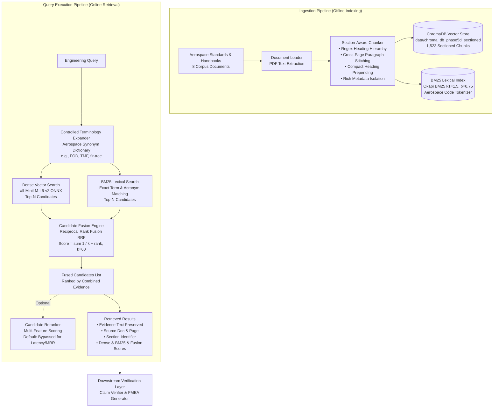

# Phase 5D — Section-Aware Hybrid Retrieval Architecture

## 1. System Overview

Phase 5D upgrades the FMEA-GPT information retrieval layer from a flat, fixed-character window chunker with dense-only vector search into an evidence-grounded, section-aware hybrid retrieval subsystem.

The architecture addresses the root causes discovered during Phase 5C:
1. **Header Dilution:** Repetitive standard cover headers (e.g., `DEPARTMENT OF DEFENSE MIL-STD-1629A...`) overwhelming dense vector similarity space.
2. **Page & Sentence Fracturing:** Blind 1000-character windows severing mathematical equations, definitions, and regulatory requirements across chunk boundaries.
3. **Lexical Keyword Misses:** Cosine vector similarity failing to prioritize exact aerospace terminology, acronyms, and section codes.

---

## 2. End-to-End Architectural Pipeline



---

## 3. Core Architectural Components

### 3.1. Section-Aware Chunker (`src/rag/section_chunker.py`)
- **Hierarchy Extraction:** Uses regex patterns tailored to military and civil aviation regulatory standards:
  - `MIL-STD-1629A` / `MIL-HDBK-338B`: `TASK 101`, `SECTION 4`, `4.3.4 (Single failure analysis)`, `101.2.1`.
  - `EASA CS-E`: `CS-E 510 (Safety Analysis)`, `CS-E 800 (Bird Strike and Ingestion)`, `CS-E 515`.
  - `FAA AC 33.75-1A`: `Section 11`, `Paragraph 7`, `Appendix 1`.
  - `NASA Handbooks`: `Chapter 3`, `Section 2.1`.
- **Header Dilution Elimination:** Instead of prepending the 100-character document title and publishing authority to every single chunk (which caused all chunks from the same document to cluster artificially), the chunker prepends only a compact identifier: `[CS-E 800 (Bird Strike)]` or `[MIL-STD-1629A 4.3.4]`.
- **Text & Metadata Separation:** Technical content alone forms the embedding text. Provenance attributes (`source_document`, `page_number`, `section`, `publisher`, `chunk_id`) are preserved in ChromaDB metadata.
- **Cross-Page Stitching:** If a page ends mid-sentence (no terminal punctuation) and the next page begins without a new header, paragraphs are joined smoothly before chunk boundary evaluation.

### 3.2. Lexical BM25 Retrieval Engine (`src/rag/bm25.py`)
- **Design:** Lightweight, zero-external-dependency local Okapi BM25 implementation ($k_1=1.5, b=0.75$).
- **Aerospace-Aware Tokenization:** Custom regex tokenizer preserves:
  - Regulatory section numbers (e.g., `33.75-1A`, `CS-E`, `1629A`).
  - Acronyms (e.g., `FOD`, `TMF`, `CIL`, `SPF`, `NDT`).
  - Hyphenated technical terms (e.g., `fir-tree`, `thermomechanical`, `fail-safe`).
- **Memory Footprint:** Built dynamically on retriever startup from indexed ChromaDB documents, requiring <10 MB RAM.

### 3.3. Controlled Terminology Expansion (`src/rag/terminology_expansion.py`)
- **Deterministic Synonym Ontology:** Maps ambiguous or multi-expression engineering terms without hallucination or generative drifting:
  - `FOD` $\leftrightarrow$ `foreign object damage`, `foreign object impact`, `bird strike ingestion`
  - `TMF` $\leftrightarrow$ `thermomechanical fatigue`, `thermal fatigue`
  - `fir-tree` $\leftrightarrow$ `fir tree`, `dovetail`, `blade root attachment`
  - `blade liberation` $\leftrightarrow$ `blade release`, `blade separation`, `uncontained blade`
- **Execution Mode:** Appends synonyms to the query string to broaden lexical coverage without deleting original query tokens.

### 3.4. Reciprocal Rank Fusion (RRF) (`src/rag/hybrid_retriever.py`)
To merge disjoint candidate lists from Dense and Lexical search without relying on incompatible score normalization:
$$\text{RRF Score}(d) = \sum_{m \in \{\text{dense}, \text{bm25}\}} \frac{1}{k + r_m(d)}$$
where $k = 60$ and $r_m(d)$ is the 1-based rank of document $d$ in retrieval method $m$.

### 3.5. Candidates Reranker (`src/rag/reranker.py`)
- Evaluates multi-feature scoring:
  - Dense cosine similarity weight ($w_1 = 0.50$)
  - BM25 normalized score weight ($w_2 = 0.25$)
  - Exact technical phrase matches ($w_3 = 0.15$)
  - Section title keyword alignment ($w_4 = 0.10$)
- **Empirical Deployment Status:** Disabled by default in production configuration because Phase 5D ablation demonstrated that Section-Aware Dense and Hybrid RRF achieve superior MRR (0.6075 vs 0.5736) with lower latency (-50 ms).

---

## 4. Interface Compatibility & Provenance

The unified interface is maintained in `src/rag/retriever.py` and `src/rag/hybrid_retriever.py`:
```python
retriever = HybridRetriever(config_path="configs/retrieval_phase5d.yaml")
results = retriever.retrieve("blade release uncontained fragment", top_k=5)
```

Each `RetrievalResult` data object preserves full provenance:
```python
@dataclass
class RetrievalResult:
    content: str
    source_document: str
    page_number: int
    score: float
    metadata: Dict[str, Any]
    section: str = ""
    dense_score: Optional[float] = None
    bm25_score: Optional[float] = None
    fusion_score: Optional[float] = None
```
No evidence text is modified, summarized, or synthesized.
